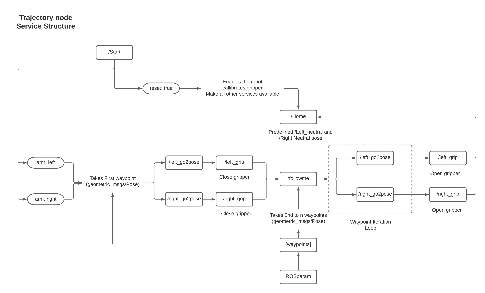

# Baxter Control Package for Mimicking Human Actions


# Workflow


##  __Steps to Launch on Actual Robot__
- Connect to Rethink
  ```
  nmcli connection up Rethink
  ```
- Check connection using 
  ```
  ping baxter.local
  ```
- Set ROS Master URI in each terminal you use using:
  ```
  export ROS_MASTER_URI=http://10.42.0.2:11311
  export ROS_IP=10.42.0.1
  unset ROS_HOSTNAME
  ```
    or use script
    ```
    source connect_baxter.sh
    ```
- Check if `Joint_states` are published by the robot
  ```
  rostopic echo /robot/joint_states
  ```
- Enable Baxter
  ```
  rosrun baxter_tools enable_robot.py -e
  ```
- Check status of Robot
  ```
  rosrun baxter_tools enable_robot.py -s
  ```
- Source rethink_ws, moveit_robots_ws and this project_ws before using launch file below
  - Verify if all workspaces are set to `ROS_Package_Path` using
  - ```
    printenv | grep ROS_PACKAGE_PATH
    ```
- Launch RViz interface and trajectory node
  ```
  roslaunch baxter_control basic.launch left_electric_gripper:=true right_electric_gripper:=true run_trajectory_node:=true 
  ```
  Debug:
  ```
  roslaunch baxter_control basic.launch use_joint_joystick:=true left_electric_gripper:=true right_electric_gripper:=true
  rosrun baxter_control trajectory
  ```
  *`joint_trajectory_action_server.py` is included in the launch file*

- Disable the robot
  ```
  rosrun baxter_tools enable_robot.py -d
  ```

# __Steps to Launch in Simulation__
- Use command below to launch baxter robot in simulation, optionally set `run_trajectory_node:=true` to run `trajectory` node
  ```
  roslaunch baxter_control basic.launch use_simulation:=true
  ```
  **Wait, this may take time**
## Launch file configuration options:

Args | Default | Description
------------ | ------------- | -------------
`run_trajectory_node:=true`|`false`| Optionally run trajectory node
`use_simulation:=true` |`false`| Optionally load Baxter robot in simulation
`headless:=true`|`true`| Run Gazebo in headless mode
`gui:=true`|`false`| Run Gazebo with GUI
`left_electric_gripper:=true`|`true`| Use baxter with left gripper enabled
`right_electric_gripper:=true` |`true`|Use baxter with right gripper enabled
`use_gripper_joystick` | `false` | Control and callibrate left and right gripper using controller
`use_joint_joystick` | `false` | Control arm joints as well as gripper using controller
`joystick` | `xbox` | set controller (xbox | Logitech | PS4)
`dev` | `/dev/input/js0` | path to controller

# Services available
- home: move left and right arm to predefined `left_neutral` and `right_neutral` position respectively
  ```
  rosservice call /home "reset: true" 
  ```
- start: To initialize all services and calibrates left and right gripper
  ```
  rosservice call /start "reset: true" arm:"none"
  ```
  To initialize __followme__ sequence as shown in the flowchart above
  ```
  rosservice call /start "reset: false" arm:"left"
  ```
  you may reset as well as initialize sequence, both together as well! but in this case ypu wont go to `home` position, you will go to first waypoint instead (assuming waypoints are already loaded in rosparam server).
   ```
  rosservice call /start "true: false" arm:"left"
  ```

- left_go2pose: if `grip` is set `True` this servive calls `left_grip` service after its execution is __successful__
  ```
  rosservice call /left_go2pose "goal_position:                          
    x: 0.0
    y: 0.0
    z: 0.0
  goal_orientation:
    x: 0.0
    y: 0.0
    z: 0.0
    w: 0.0
  grip: false" 
  ```
- right_go2pose: if `grip` is set `True` this servive calls `right_grip` service after its execution is __successful__
  ```
  rosservice call /right_go2pose "goal_position:                     
    x: 0.0
    y: 0.0
    z: 0.0
  goal_orientation:
    x: 0.0
    y: 0.0
    z: 0.0
    w: 0.0
  grip: false"  
  ```
- left_grip: close left gripper using input `state: 1` and open using `state: 0`
  ```
  rosservice call /left_grip "state: false" 
  ```
- right_grip: close right gripper using input `state: 1` and open using `state: 0`
  ```
  rosservice call /right_grip "state: false"   
  ```
- followme: Specify the `arm` which should follow *waypoints* trajectory
  ```
  rosservice call /followme "arm: 'left'"
  ```
---

## *Dependencies*
Title | Link
------------ | -------------
RethinkRobotics| [Github](https://github.com/RethinkRobotics)
moveit_robots | [Github](https://github.com/ros-planning/moveit_robots)
---

## *Baxter Home Positions:*

*Left Gripper*
```
position: 
  x: 0.6494685697319907
  y: 0.8371804136224866
  z: 0.043937503445779125
orientation: 
  x: -0.3801916530737042
  y: 0.9235212614290408
  z: 0.020782280350508237
  w: 0.0461614930979309
```

*Right Gripper*
```
position: 
  x: 0.6544330865980147
  y: -0.841170466336113
  z: 0.054577985020326486
orientation: 
  x: 0.3804649229042976
  y: 0.9229889441554372
  z: -0.023015433956129042
  w: 0.05299189755112533
```
## RQT Graph

